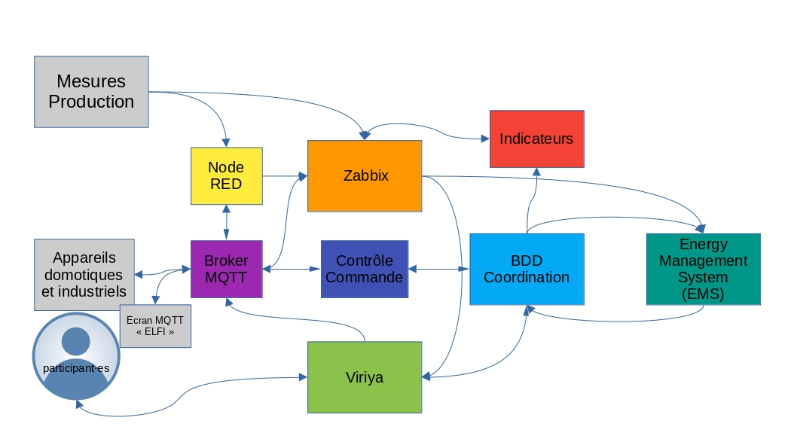

# Projet ELFE - Documentation Générale

## Description
Ce dépôt contient la documentation générale de l'infrastructure informatique déployée dans le projet ELFE.

Cette infrastructure, entièrement sous licence libre, est composée de logiciels pré-existants et de programmes écrits spécifiquement pour le projet. Ces composants informatiques sont à retrouver dans leurs dépôts dédiés.
L'objectif de cette documentation est de décrire l'infrastructure dans son ensemble, en précisant les interconnexions et les configurations spécifiques de chaque logiciel.

Pour en savoir plus sur le projet ELFE - *Expérimentons Localement la Flexibilité Energétique*, consulter : https://www.projet-elfe.fr

## Auteurs et Licence
* Cette documentation a été écrite par **Elias Martin - Astrolabe CAE**, co-coordinateur du projet ELFE 
* Il appartient à l'association **Energies Citoyennes en Pays de Vilaine** - contact@enr-citoyennes.fr
* Dans un but d'essaimage et de construction coopérative, il est partagé sous licence EUPL v1.2
